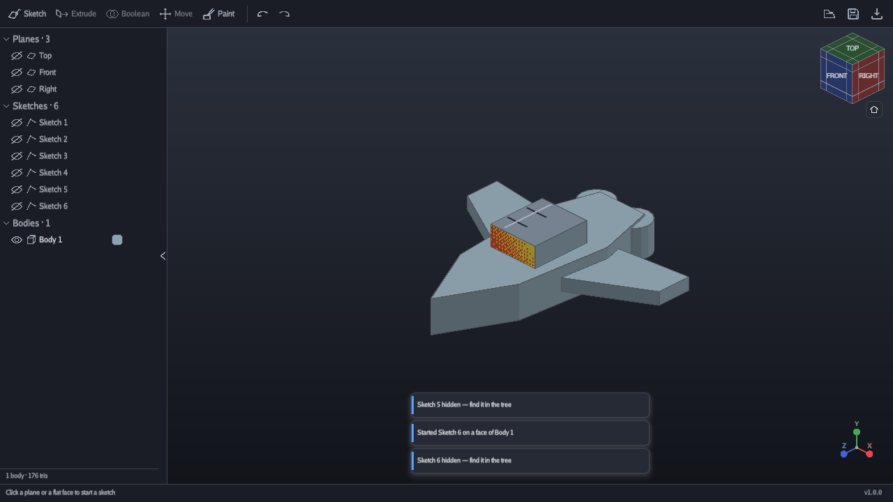

# Modeler

A 3D modelling tool for pixel-art spaceships. Sketch a profile on a plane, pull
it into a solid, cut and combine, then paint the faces pixel by pixel — and take
the result out as glTF, OBJ, STL or a PNG.

Everything is grid-snapped and every texture is sampled nearest-neighbour, all
the way out to the exported file. The pixels you place are the pixels you get.



## Quickstart

Run it, and press **Sample ship** on the welcome card to see what it makes.
To build one yourself:

1. **Click a plane** in the viewport or the tree — Top, Front or Right. The
   camera turns to face it and a grid appears.
2. **Draw a closed profile** with Line (`L`), Rectangle (`R`) or Circle (`C`).
   Closed shapes fill in; loose ends show as red rings, because only a closed
   profile can be pulled into a solid. The **Grid** chips on the sketch card
   set the grid and snap spacing, from a quarter unit to two.
3. **Press `E`** and drag the arrow. The Extrude card sets the depth, a draft
   angle, and whether the result is a new body or is added to, cut out of, or
   intersected with what it reaches.
4. **Click a flat face** and press `S` to sketch on it, or drag its arrow to
   push and pull it directly.
5. **Press `P`** to paint. Pick a resolution, pick a colour, and draw on the
   model. The texels under the brush are outlined on the surface, so you always
   know which pixel you are about to hit.
6. **Ctrl+S** to save, **Ctrl+E** to export.

The hint bar at the bottom always says what to do next. If a control is greyed
out, its tooltip says how to turn it on.

## Keyboard

| | |
|---|---|
| **Navigate** | |
| Right-drag / Middle-drag / Wheel | Orbit / Pan / Zoom to cursor |
| `F` / `O` | Frame selection / Orthographic ⇄ perspective |
| **Tools** | `S` sketch · `E` extrude · `B` boolean · `M` move · `P` paint |
| **Sketch** | `V` select · `L` line · `R` rectangle · `C` circle |
| **Paint** | `D` pencil · `B` soft brush · `E` eraser · `G` fill · `I` pick |
| | `L` line · `R` rectangle · `C` circle · `N` gradient · `X` swap colours |
| **Files** | `Ctrl+N` new · `Ctrl+O` open · `Ctrl+S` save · `Ctrl+Shift+S` save as · `Ctrl+E` export |
| **Edit** | `Ctrl+Z` undo · `Ctrl+Y` redo · `Del` delete · `H` hide |
| **Held** | `Alt` no snapping, or eyedropper in paint · `Ctrl` fine snap · `Shift` add to selection, constrain a shape |
| `Esc` | Back one level · `?` the shortcut sheet |

## Painting, and why the exports look right

Face paint is anchored to a frame that belongs to the face, not to the
triangles under it, so pixels stay where you put them when the geometry
underneath changes. Cut a window through a painted hull and the paint on both
sides of the cut is still exactly where it was.

The **dither modes** (2×2, 4×4, 8×8 Bayer) are how a gradient or a soft brush
gets a middle without leaving the palette: the shading is spent on how many
whole texels are painted, not on inventing colours between two of them.

Exports carry the same promise as far as the format allows:

- **glTF** (`.glb` or `.gltf`) writes `NEAREST` filtering into the file, so an
  engine loads it looking right without being told.
- **OBJ** (`+ .mtl + paint/*.png`) has no way to say that, so set your renderer
  to nearest filtering by hand. The file says so in its header.
- **STL** is geometry only — the format carries no colour at all.
- **PNG** exports the current view at 1×, 2× or 4×, with the option of a
  transparent background. Whole-number scales only, so the pixels stay square.

## Files

Ships are saved as `.ship`: a zip holding the document, one PNG per painted
face, and a thumbnail. Dropping a `.ship` on the window opens it. Unsaved work
is autosaved every two minutes and again if the program ever crashes; the next
launch offers it back — and anything that would replace unsaved work, from
Ctrl+N to the window's close button, asks first.

Settings, autosaves and crash logs live in `%APPDATA%\Modeler`. Set
`MODELER_CONFIG_DIR` to put them somewhere else.

## Building from source

Needs Go 1.26 and a MinGW-w64 gcc on `PATH` — cgo is required, for raylib and
for the boolean kernel.

```
set CGO_ENABLED=1
go build ./...
go test ./...
go run ./cmd/modeler
```

A release build, which must be statically linked or it will not start on a
machine without MinGW:

```
go build -ldflags "-s -w -H windowsgui -extldflags=-static" -o modeler.exe ./cmd/modeler
```

The program can also drive itself, which is how it is tested: `modeler.exe
-headless -script <ops.json> -out <dir>` runs a script of operations against a
hidden window and writes PNGs. `assets/sample_ship.json` is one such script —
it is the ship on the welcome card, the end-to-end test, and the image at the
top of this file.

## Credits

Modeler stands on:

| | |
|---|---|
| [raylib](https://www.raylib.com/) via [raylib-go](https://github.com/gen2brain/raylib-go) | window, input, GPU rendering and text — zlib |
| [Manifold](https://github.com/elalish/manifold) v3.5.2 | the boolean kernel, the same one OpenSCAD uses — Apache-2.0 |
| [Clipper2](https://github.com/AngusJohnson/Clipper2), vendored inside Manifold | BSL-1.0 |
| [zenity](https://github.com/ncruces/zenity) | native file dialogs — MIT |
| [Go Regular](https://go.dev/blog/go-fonts) via `golang.org/x/image` | the UI typeface — BSD-3-Clause |

Licence texts for the vendored kernel are in `third_party/manifold/`.

The 32-colour palette is original to this program: four ramps of eight, tuned
for hull plating rather than for covering the colour wheel. Lospec `.hex`
palettes can be imported over it.
